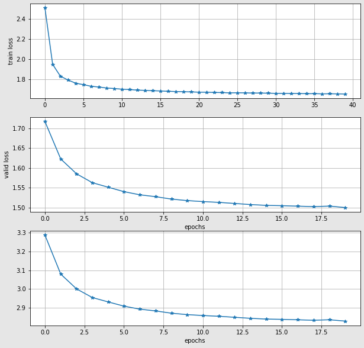

# Character-Level Language Model
Made by igor-vgs
## Model architecture
Embedding -> 2-layer GRU -> ReLU -> classification head.
* Vocabulary size: 270;
* Embedding size: 100;
* GRU hidden size: 50
## To reproduce results
**First step**: download data:
```
bash get_data.sh
```
**Second step**: install requirements:
```
pip install requirements.txt
```
**Third step**: train model:
```
python train.py --train_path ./data/wikitext-2/wiki.train.tokens \
                --valid_path ./data/wikitext-2/wiki.valid.tokens \
                --max_length 20 \
                --batch_size 500 \
                --embedding_size 100 \
                --hidden_size 50 \
                --learning_rate 0.001 \
                --train_epochs 20 \
                --log_step 1500 \
                --checkpoint_dir ./checkpoints/ \
                --prefix char_level_gru \
                --metric_name val_ppl \
                --device cuda \
                --seed 42
```
## Results
**Validation loss**: 1.503  
**Validation PPL**: 2.834  
### Graphics
